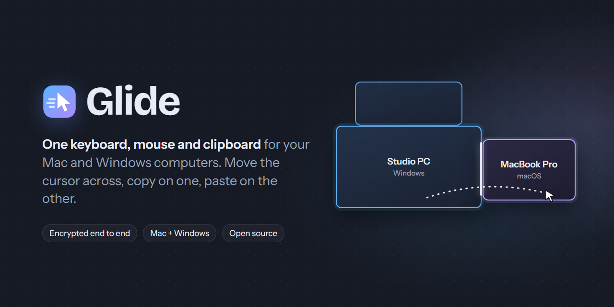
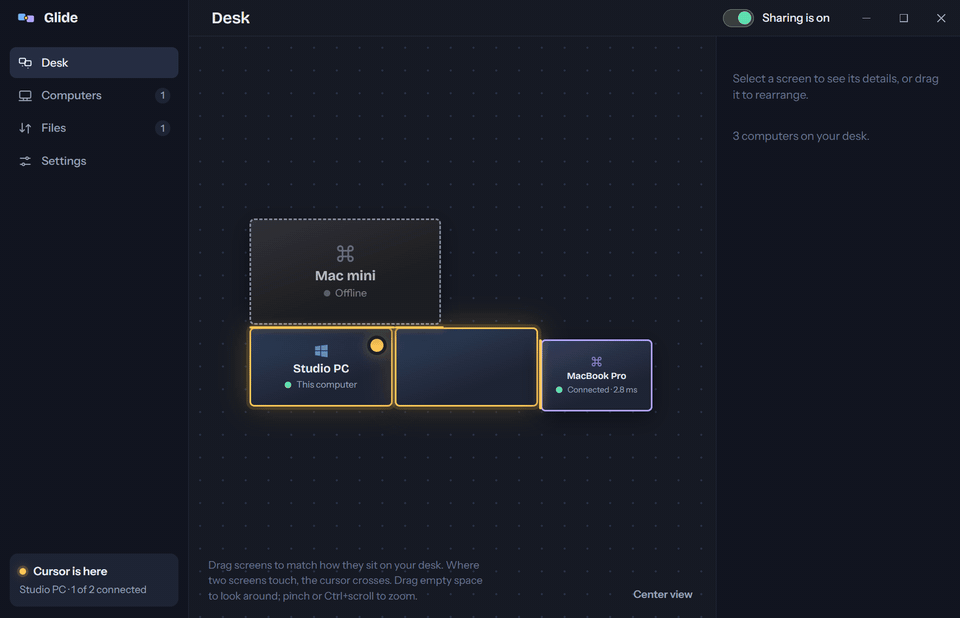
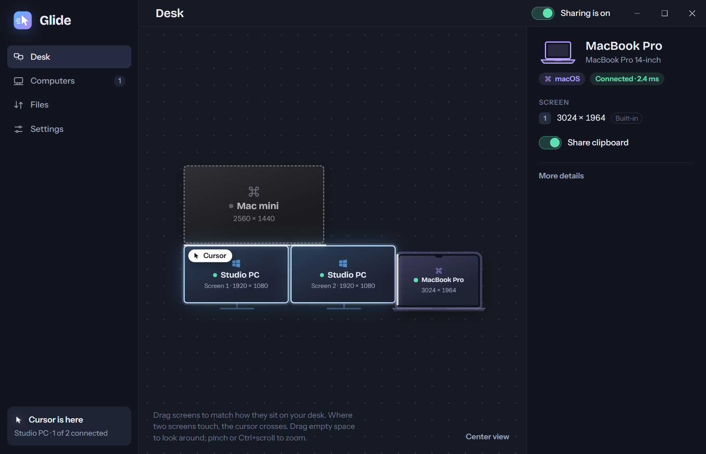
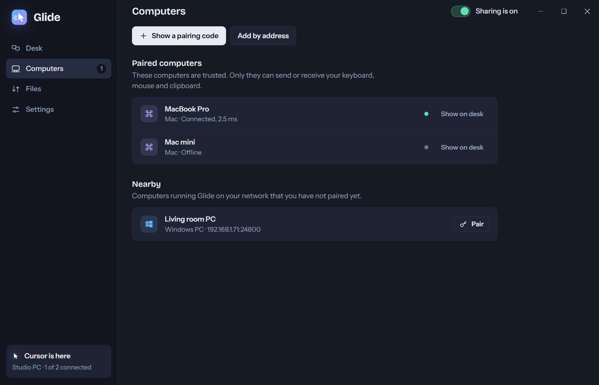

<p align="center"></p>

<p align="center">
  <a href="https://github.com/itsonlyfrans/glide/releases/latest"><b>Download</b></a> ·
  <a href="#how-it-works">How it works</a> ·
  <a href="#security">Security</a> ·
  <a href="#build-from-source">Build from source</a>
</p>

Glide lets one keyboard and mouse drive all your computers. Push the cursor off the edge of your PC's screen and it
appears on your Mac. Copy text, an image or a file on one computer and paste it on the other. It works between
Windows and macOS in any combination, over your own network, with everything encrypted.

<p align="center"><br><sub>Recorded from the real app with simulated computers. <a href="docs/images/demo.mp4">MP4 version</a>.</sub></p>

## Features

- **Move the cursor across.** Arrange your computers on the Desk the way they sit on your desk; where two screens
  touch, the cursor crosses. Multi-monitor setups and mixed display scaling are handled. Ungroup a computer's screens
  to place each one on its own, from whichever computer you are sitting at.
- **Wakes the other computer.** Push the cursor toward a computer that has gone to sleep and Glide wakes it over the
  network (Wake-on-LAN), or press *Wake* on the Desk.
- **Shared clipboard.** Text, rich text, images and files. Large files copy in the background and are ready to paste
  when they arrive; anything a password manager marks as sensitive is never shared.
- **Shortcuts that feel native.** Ctrl+C on a Windows keyboard is Cmd+C on the Mac and the other way round; Alt+Tab
  and Cmd+Tab switch apps on whichever computer you are controlling. Back/Forward mouse buttons work too.
- **Feels like a local mouse.** Pointer speed and acceleration settings, latest-position-wins cursor movement,
  high-priority input threads, and frame-paced smoothing when Wi-Fi delivers movement in bursts, so a 120 Hz screen
  stays fluid and a busy computer stays smooth.
- **Always ready, tiny.** The engine runs quietly in the background (about 15 MB of memory). The whole app is about
  15 MB installed. It reconnects by itself and wakes a sleeping screen when the cursor arrives.
- **Updates itself.** Signed updates install with one click.

## Install

Download the latest release from the [Releases page](https://github.com/itsonlyfrans/glide/releases/latest):

| Computer | File | Notes |
|---|---|---|
| **Mac** with Apple Silicon (M1 or newer) | `Glide_<version>_aarch64.dmg` | Signed and notarized by Apple. Drag Glide into Applications. |
| **Windows** 10 or 11 (64-bit) | `Glide_<version>_x64-setup.exe` | If Windows shows "Windows protected your PC", choose **More info → Run anyway**. |

Then:

1. **Open Glide on both computers.** On the Mac, allow **Accessibility** and **Input Monitoring** when asked (the
   app guides you; if macOS stays silent it offers *Reset and ask again*). Allow local network access too.
2. **Pair them.** On one computer choose **Show a pairing code**. On the other, pick it under **Nearby** (or *Add by
   address*) and type the 6-digit code. Both screens then show three words: check they match and confirm.
3. **Arrange the Desk.** Drag the computers so they match your desk. Done.

Escape hatch: **Ctrl+Alt+Shift+Home** always brings the cursor back to the computer you are sitting at.

<p align="center">
  
  
</p>

## How it works

Every computer runs the same small engine, **`glided`** (Rust). The engine on the computer you are using watches the
cursor; when it reaches a shared screen edge it hands control to the other computer and streams input to it over an
encrypted connection, while that computer's engine moves its own cursor and presses its own keys. The clipboard and
files travel on separate streams so a large copy never slows the mouse down.

The Glide window is a small [Tauri](https://tauri.app) app that uses the system's own web view. It only talks to the
engine on the same computer, never to the network.

```
 ┌────────── Windows PC ──────────┐                    ┌──────────── Mac ─────────────┐
 │ Glide window ── local pipe ──┐ │   QUIC + mutual    │ ┌── stdio ── Glide window      │
 │                     glided ◄─┘ ├──── TLS, pinned ───┤ └─► glided                     │
 │  keyboard/mouse hooks, clipboard│   (one connection  │  event taps, clipboard        │
 └─────────────────────────────────┘    per paired pair)└──────────────────────────────┘
```

The full design, protocol and security contract are in [`docs/SPEC.md`](docs/SPEC.md).

## Security

Glide is built so that nobody else on your network can see or inject what you type.

- **Pairing you can verify.** A one-time 6-digit code runs a PAKE (SPAKE2) bound to the TLS session, and both screens
  show the same three words before anything is trusted. A guessed or intercepted code does not let anyone in.
- **Pinned, encrypted connections.** Each computer has its own key, kept in the operating system's keychain or
  credential store. Paired computers talk only over QUIC with mutual TLS pinned to each other's key; nothing else is
  accepted.
- **Nothing exposed locally.** The window reaches the engine through a channel only your user account can open,
  protected by a token. Discovery on the network announces only the computer's name and type.
- **Signed releases and updates.** macOS builds are signed and notarized; updates are signed and verified before
  they install.

Found a vulnerability? Please follow [SECURITY.md](SECURITY.md).

## Build from source

Requirements: [Rust](https://rustup.rs) (stable), [Node.js](https://nodejs.org) 22 with [pnpm](https://pnpm.io), and
the [Tauri prerequisites](https://tauri.app/start/prerequisites/) for your system (Visual Studio Build Tools and
WebView2 on Windows, Xcode Command Line Tools on macOS).

```sh
cd desktop
pnpm install
pnpm build          # builds the engine (core/) and the installer for this computer
```

Useful while developing:

```sh
cd core && cargo test --workspace     # the engine's tests
GLIDE_MOCK=1 pnpm exec tauri dev      # the window against a simulated engine (needs Node), from desktop/
```

| Folder | What is inside |
|---|---|
| `core/` | The engine: protocol, networking and pairing, Windows and macOS input/clipboard, file transfer |
| `desktop/` | The Tauri app (`src-tauri/`), the screens (`ui/`) and development tools (`dev/`) |
| `docs/` | Design and security contract (`SPEC.md`), release process, images |

## Contributing

Issues and pull requests are welcome. Please run `cargo fmt`, `cargo clippy --workspace --all-targets -- -D warnings`
and `cargo test --workspace` in `core/` before opening a pull request, and describe how you tested on Windows and/or
macOS.

## License

[MIT](LICENSE)
